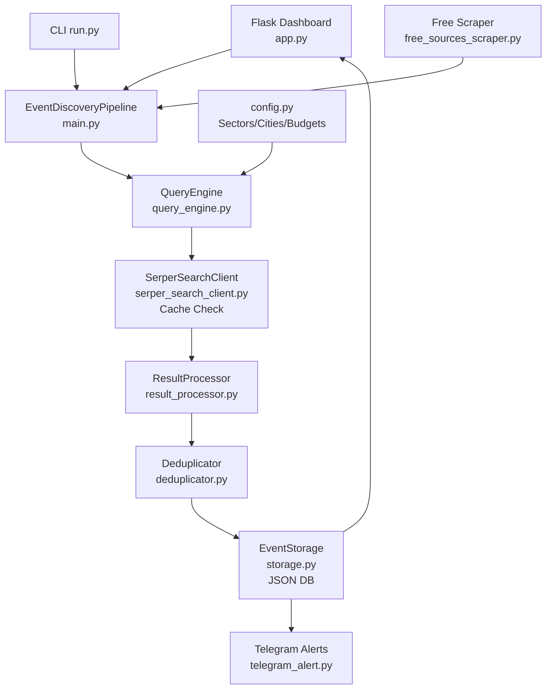
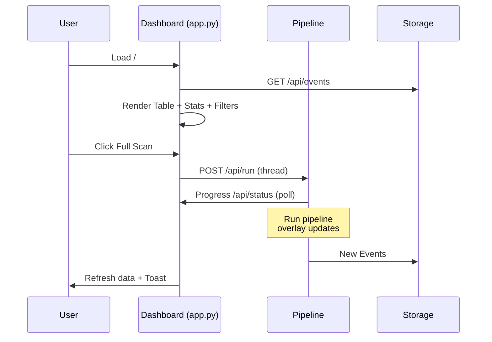
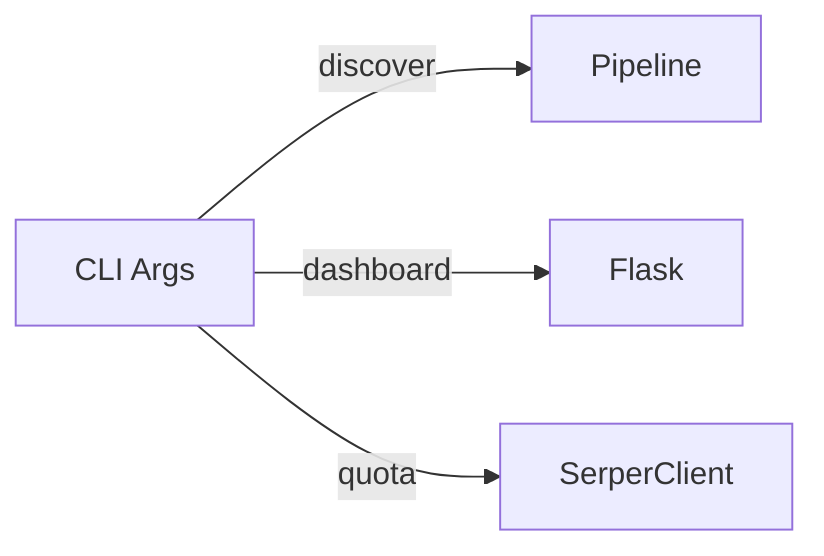
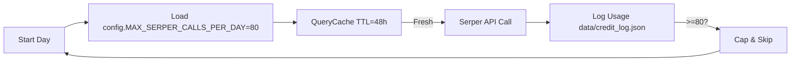
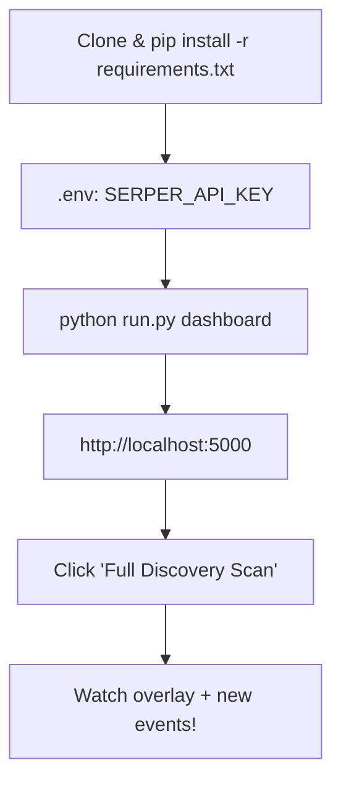

# 🚀 Events & Awards Discovery Engine (Full Upgrade v5.0) - Enhanced with Flow Blocks

[](http://localhost:5000)

A high-precision, credit-optimized pipeline designed to discover premium business events, summits, conferences, and awards exclusively in India **(2026 focus)**.

## 🧐 What is this project?
The E&A Discovery Engine is a heavily automated backend scraper + frontend dashboard. It identifies upcoming industry events in India, parses dates, locations, **nomination deadlines**, and provides a real-time tracking interface with confidence scoring and Telegram alerts.

## 🔥 v5.0 Master Upgrade Highlights
| Feature | Benefit |
|---------|---------|
| **Serper API** (80 queries/day cap) | High-speed Google CSE with strict budgeting |
| **Query Caching** (48h TTL) | ~70% credit savings |
| **Tiered Queries** | Awards-first + city-consolidated + organizers |
| **Free Layers** (disabled) | 10times, Townscript RSS (toggle in config) |
| **NLP Extraction** | Nomination deadlines, venues, organizers |
| **Smart Dedup** | Fuzzy matching (85% threshold) |
| **Premium UI** | Filters, stats, overlays, CSV export |
| **Alerts** | Telegram for high-confidence nominations |

---

## 🏗️ Architecture Overview



**Key Data Flow**: Config → Queries → Search (cache/API) → Extract → Dedup → Store → UI/Alerts

---

## 🔄 Discovery Pipeline Flow (Detailed)

```mermaid
flowchart TD
    Start([Daily Budget Check<br/>80 Serper max]) --> Q{Query Cache<br/>48h TTL?}
    Q -->|Hit| Skip[Skip Query]
    Q -->|Miss| Gen[QueryEngine:<br/>Tier 1 Awards (20q)<br/>Tier 3 Cities (50q)<br/>Tier 3 Organizers (10q)]
    Gen --> Search[SerperSearchClient:<br/>JSON Results]
    Search --> Proc[ResultProcessor:<br/>NLP Extract<br/>Dates/Venues/Deadlines<br/>Confidence Score]
    Proc --> Filter[>=50% Conf<br/>India Geo-filter]
    Filter --> Dedup[Deduplicator:<br/>Fuzzy 85%<br/>Name/Date/Venue]
    Dedup --> Store[EventStorage:<br/>JSON Append]
    Store --> Alert{should_alert?<br/>High Conf + Deadline}
    Alert -->|Yes| Telegram[Telegram Push]
    Store --> End[Update Dashboard<br/>New Found +1]
    Skip --> End
```

**Budget Allocation Example**:
| Tier | Queries | Example Query |
|------|---------|---------------|
| 1 Awards | 20 | `"Fintech awards India 2026 nominations open"` |
| 3 Cities | 50 | `(BFSI OR Tech) (Mumbai OR Delhi OR ...) 2026` |
| 3 Organizers | 10 | `ET "{sector}" summit 2026` |

---

## 📊 Dashboard Features Flow



**UI Highlights**:
- **Filters**: Category (Awards/Events), Sector (25+), Status (Upcoming/Nominations), City (80+), Keyword.
- **Triggers**: Full Serper Scan, Free Quick Scan.
- **Stats**: Total/Awards/Events/Sectors, Serper credits (daily/monthly).
- **Visuals**: Confidence dots (Red<50/Yellow75+/Green90+/Blue), Countdowns.

---

## ⚙️ CLI Usage (run.py)

```bash
# Dashboard (default)
python run.py dashboard

# One-time discovery
python run.py discover --sector Fintech

# Check quota
python run.py quota

# Scheduled mode
python run.py all --live
```



---

## 📈 Budget & Optimization Flow



---

## 🔧 Core Components Deep Dive

| Component | Purpose | Config Driven |
|-----------|---------|---------------|
| `QueryEngine` | Tiered queries from SECTORS/CITIES | Yes |
| `SerperSearchClient` | Cached Google CSE | API Key + TTL |
| `ResultProcessor` | NLP extract (dates, deadlines, conf %) | EVENT/AWARD_INDICATORS |
| `Deduplicator` | Fuzzy match events | 85% threshold |
| `EventStorage` | JSON CRUD + CSV export | DATA_DIR |
| `TelegramAlert` | High-value noms | ENABLE_TELEGRAM_ALERTS |

**Sectors Tracked** (25+ from config.py):
```
BFSI, Fintech, Tech, Healthcare, Startups, Retail, eCommerce, D2C...
```

---

## 🚀 Quick Start Flow



### Setup (Repeated for Clarity)
```bash
pip install -r requirements.txt
cp .env.example .env  # Add SERPER_API_KEY
python app.py
```

---

## 📊 Success Metrics & Troubleshooting
- **Coverage**: 80 cities, 25 sectors, 2026-focused.
- **Credits**: Hard-capped, cached – stays free tier.
- **Troubleshoot**: Check `logs/assistant.log`, `data/credit_log.json`.

**Contribute**: Add sectors to config.py, improve extractors!

---
*Built with ❤️ by BLACKBOXAI – Elite Flow Documentation v1.0*
